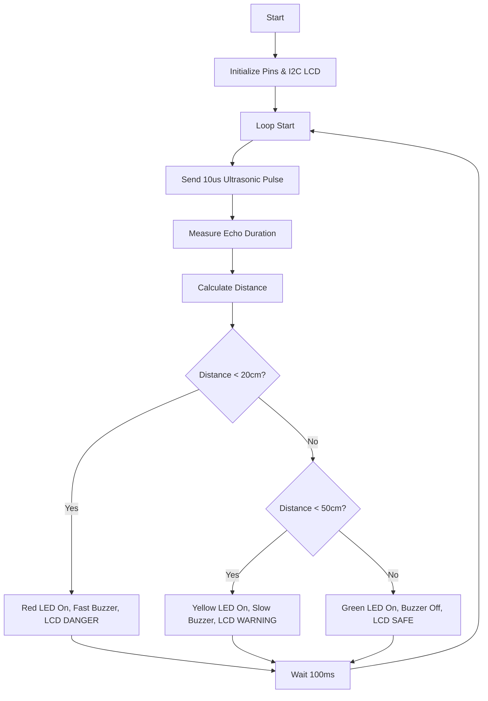

# System Architecture

## System Workflow

```mermaid
graph TD;
    A[Start] --> B[Initialize Pins & I2C LCD];
    B --> C[Loop Start];
    C --> D[Send 10us Ultrasonic Pulse];
    D --> E[Measure Echo Duration];
    E --> F[Calculate Distance];
    F --> G{Distance < 20cm?};
    G -- Yes --> H[Red LED On, Fast Buzzer, LCD DANGER];
    G -- No --> I{Distance < 50cm?};
    I -- Yes --> J[Yellow LED On, Slow Buzzer, LCD WARNING];
    I -- No --> K[Green LED On, Buzzer Off, LCD SAFE];
    H --> L[Wait 100ms];
    J --> L;
    K --> L;
    L --> C;
```
