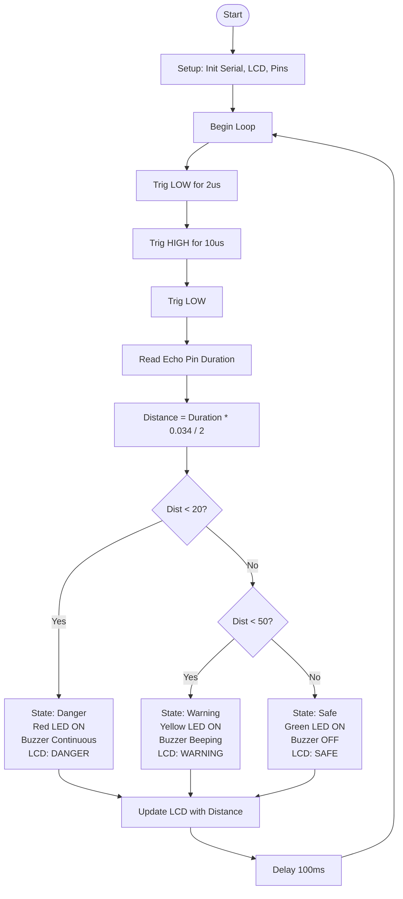

# Software Flowchart

```mermaid
flowchart TD
    Start([Start]) --> Setup[Setup: Init Serial, LCD, Pins]
    Setup --> Loop_Start[Begin Loop]
    Loop_Start --> Trig_Low[Trig LOW for 2us]
    Trig_Low --> Trig_High[Trig HIGH for 10us]
    Trig_High --> Trig_Low_2[Trig LOW]
    Trig_Low_2 --> Read_Echo[Read Echo Pin Duration]
    Read_Echo --> Calc_Dist[Distance = Duration * 0.034 / 2]
    Calc_Dist --> Check_Dist1{Dist < 20?}
    
    Check_Dist1 -- Yes --> State_Danger[State: Danger\nRed LED ON\nBuzzer Continuous\nLCD: DANGER]
    Check_Dist1 -- No --> Check_Dist2{Dist < 50?}
    
    Check_Dist2 -- Yes --> State_Warning[State: Warning\nYellow LED ON\nBuzzer Beeping\nLCD: WARNING]
    Check_Dist2 -- No --> State_Safe[State: Safe\nGreen LED ON\nBuzzer OFF\nLCD: SAFE]
    
    State_Danger --> Update_LCD[Update LCD with Distance]
    State_Warning --> Update_LCD
    State_Safe --> Update_LCD
    
    Update_LCD --> Delay[Delay 100ms]
    Delay --> Loop_Start
```
